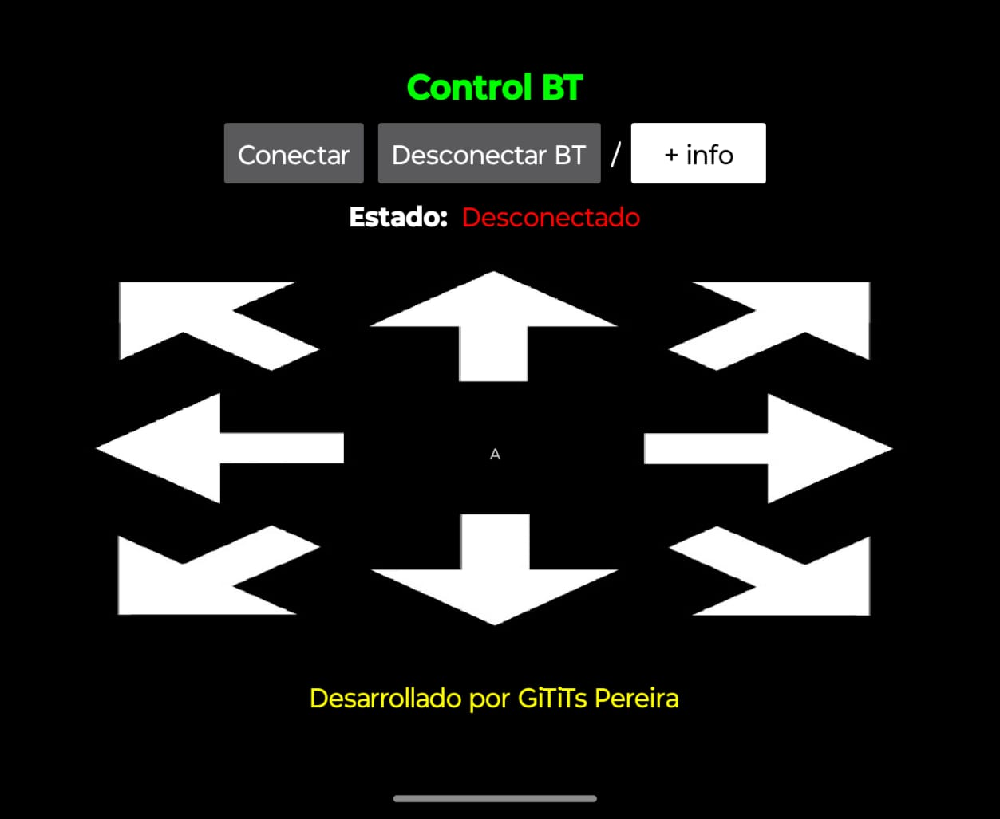

# Carro Bluetooth con ESP32
Proyecto para controlar una ESP32 de forma inalámbrica a través de una aplicación de Android con bluetooth.

## Componentes necesarios
* ESP32
* Motorreductores
* Driver L298N (Puente H)
* Batería de 6-12V
* Cables
* Dispositivo móvil con Android

---

## Guía de conexión
Este es el diagrama de conexiones para el proyecto:

Sigue los pasos a continuación para un montaje correcto:

#### 1. Conexión de la alimentación y los motores 🔋🚗

* **Baterías al L298N:** Conecta el polo **positivo (+) de la batería** al pin **12V** del módulo L298N. Conecta el polo **negativo (-) de la batería** al pin **GND** del mismo módulo.
* **Motores al L298N:** Conecta los cables del **motor izquierdo** a los pines **OUT1 y OUT2**. Conecta los cables del **motor derecho** a los pines **OUT3 y OUT4**.

#### 2. Conexión del L298N a la ESP32 🧠🔌

* **Pines de control:**
    * Conecta el pin **ENA** del L298N al pin **13** de la ESP32.
    * Conecta el pin **IN1** del L298N al pin **12** de la ESP32.
    * Conecta el pin **IN2** del L298N al pin **14** de la ESP32.
    * Conecta el pin **IN3** del L298N al pin **27** de la ESP32.
    * Conecta el pin **IN4** del L298N al pin **26** de la ESP32o.
    * Conecta el pin **ENB** del L298N al pin **25** de la ESP32.
* **Pines de alimentación:** Conecta el pin **5V** del driver L298N al pin **Vin** de la ESP32 o y el pin **GND** del L298N a un pin **GND** de la ESP32.

---

## Código para ESP32

### Carga del Código en Arduino IDE 👨‍💻

1. **Instala el IDE de Arduino:** Si aún no lo tienes, descarga e instala el **IDE de Arduino** desde su [página oficial](https://www.arduino.cc/en/software). Este software es el entorno de programación que usarás.  
2. **Agrega la ESP32 al gestor de tarjetas:** Este es un paso crucial, ya que el IDE de Arduino no incluye las placas ESP32 por defecto.
  * Abre el IDE de Arduino.
  * Ve a **Archivo>Preferencias**.
  * En el campo "URLs adicionales del Gestor de Tarjetas", pega la siguiente URL:  
     https://raw.githubusercontent.com/espressif/arduino-esp32/gh-pages/package_esp32_index.json
  * Haz clic en "OK".
3. **Instala el Paquete de la Placa ESP32:** Ahora, utiliza la URL que acabas de agregar para instalar los controladores de la ESP32.
  * Ve a **Herramientas > Placa > Gestor de Tarjetas**.
  * En el cuadro de búsqueda, escribe **esp32**.
  * Busca la opción "esp32 by Espressif Systems" y haz clic en el botón **Instalar**. Esto descargará y configurará todas las herramientas necesarias.
4. **Abre el código:** Abre el archivo `CarroBTESP32.ino` de este repositorio en el IDE de Arduino.
5. **Conecta la placa:** Conecta tu placa ESP32 a la computadora usando el cable USB. Luego, configura el IDE:
    * Ve a **Herramientas > Placa** y selecciona tu placa **ESP32**. La opción más común es "ESP32 Dev Module", pero elige la que coincida con tu placa si es diferente.
    * En **Herramientas > Puerto**, selecciona el puerto correcto al que se conectó tu ESP32. Por lo general, se muestra como **COM3** seguido de un número en Windows o **/dev/cu.usbmodem1411** en macOS.
    * **Configura los parámetros de carga:** Dependiendo de tu placa, es posible que necesites ajustar otros parámetros en el menú Herramientas, como la "Flash Frequency", "Flash Mode" y "Upload Speed". Para la mayoría de las placas, la configuración predeterminada funciona, pero si tienes problemas, es un buen punto de partida para solucionar errores.
6. **Sube el código:** Haz clic en el botón **Subir** (la flecha hacia la derecha) en la parte superior del IDE. El software compilará y cargará el código en la placa.
  * El IDE compilará el código y lo subirá a la ESP32.  

**Nota importante:** En algunas placas ESP32, es posible que debas presionar y mantener presionado el botón BOOT (o IO0) antes de hacer clic en Subir y soltarlo cuando veas el mensaje "Connecting..." en la consola inferior. Esto pone la ESP32 en modo de programación.  

**Descarga el código para Arduino aquí:** [CarroBT.ino](CarroBT.ino)

---

## Aplicación de Android

### Instalación de la Aplicación en Android 📱

Para instalar la aplicación y controlar el proyecto desde tu celular:

1.  **Descarga la APK:** Descarga el archivo de la aplicación `CarroBT.apk` que se encuentra en este repositorio.
2.  **Habilita fuentes desconocidas:** Ve a la **Configuración** de tu teléfono, busca la opción de **Seguridad y privacidad** y habilita la instalación de aplicaciones de **"Fuentes desconocidas"** o **"Instalar apps de fuentes externas"**. Este paso es necesario para instalar aplicaciones que no provienen de Google Play Store.
3.  **Instala la APK:** Busca el archivo APK que descargaste en la carpeta de descargas de tu teléfono y tócalo para iniciar la instalación.
4.  **Abre la aplicación:** Una vez instalada, busca el ícono de la aplicación en la pantalla de inicio y ábrela para empezar a usarla.* 

### Guía de Uso de la Aplicación Móvil 📱

Una vez que hayas instalado la aplicación, sigue estos pasos para conectarte a tu proyecto de Arduino y controlarlo.

1.  **Enciende el Bluetooth:** Al abrir la aplicación, un mensaje emergente te pedirá que actives el Bluetooth de tu celular si no lo está. Acepta para continuar.
2.  **Conexión a la ESP32:**
    * Presiona el botón **"Conectar"** para escanear y emparejarte con tu placa **ESP32**.
    * Verifica que el estado de la conexión cambie de **"Desconectado"** (en rojo) a **"Conectado"** (en verde).
3.  **Control del Robot:**
    * Una vez conectado, el robot responderá a las teclas de dirección.
    * **Adelante:** La aplicación envía la letra **B**.
    * **Atrás:** La aplicación envía la letra **C**.
    * **Derecha:** La aplicación envía la letra **D**.
    * **Izquierda:** La aplicación envía la letra **E**.
    * **Detener:** Al dejar de presionar las flechas, la aplicación envía la letra **A** para detener el movimiento.
    * Puedes ver la letra que se está enviando en tiempo real en la parte central de la interfaz.
4.  **Desconexión Segura:**
    * Antes de cerrar la aplicación, es recomendable presionar el botón **"Desconectar"**.
    * Confirma la desconexión observando que el estado cambie de nuevo a **"Desconectado"** (en rojo).

¡Listo! Con estos sencillos pasos, podrán utilizar la aplicación para controlar el robot sin problemas.

---

## Contacto

Cristian Camilo Cañaveral Avilés  
Ing. Mecatrónico  
Email: camilo.canaveral@itspereira.edu.co

Carlos Andrés Rodriguez Pérez  
Ing. Mecatrónico  
Email: carlos.rodriguez@itspereira.edu.co
